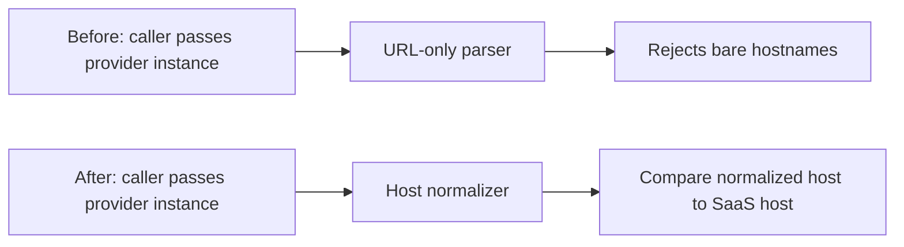

# Summary of code changes

Produce a strict 6-section summary of code changes. The user uses this for code review prep, handoffs, self-checks, and "what did I just do?" moments. They want a fast, accurate, scannable picture of *exactly* what changed, how behavior changed, and *why it might be risky*.

## When to use this skill

Trigger on requests like:

- "summarize the changes in this branch"
- "what did you change in this session"
- "give me a recap of what I just did"
- "what's in this PR"
- "explain this commit"
- "summary code"

If the user wants a *PR description* (with conventional title, test plan checkboxes, etc.), prefer the `pr-description` skill instead. This skill produces a tighter, more analytical recap focused on impact and risk — not something to paste into a PR body.

## How to gather data

Before writing the summary, find out exactly what changed. Use git directly — don't summarize from memory of what you intended to do, summarize from what's actually in the diff. Memory and reality drift.

- **Uncommitted work:** `git status`, `git diff`, `git diff --stat`
- **Current branch vs main:** `git diff main --stat`, `git diff main`, `git log main..HEAD --oneline`
- **A specific commit:** `git show <sha>`, `git show --stat <sha>`
- **A specific PR:** `gh pr diff <num>`, `gh pr view <num> --json files,additions,deletions`
- **Current session edits:** Cross-reference the files you actually edited in this session against the git diff. This catches both fabrications (claiming changes you didn't make) and omissions (forgetting something).

If the scope is ambiguous (uncommitted vs branch vs commit), ask once. Default to "everything in this branch since it diverged from main" if there's a clear feature-branch context.

## Output format

Produce **exactly these 6 sections, in this order, with these headings**. Don't add sections, don't reorder, don't skip — if a section is empty say "None" rather than dropping it. The user scans these in a fixed order; consistency matters more than concision.

### 1. Before the change

Explain the system behavior before this PR/change. Focus on what happened at runtime, not file-level implementation details.

Cover what the relevant flow did before:

- Inputs accepted or rejected
- Data/control flow between major components
- User-visible or caller-visible behavior
- Failure modes, edge cases, and limitations that motivated the change

If you cannot confidently infer prior behavior from the diff, say what is unknown and ground the explanation in the removed or changed code.

### 2. After the change

Explain the system behavior after this PR/change. Focus on the new runtime behavior and how the architecture-level flow differs from before.

Cover what the relevant flow does now:

- New or changed inputs accepted or rejected
- New data/control flow between major components
- User-visible or caller-visible behavior
- Failure modes, edge cases, and limitations that remain

Include a small Markdown architecture diagram when the change has a meaningful flow or component interaction. Prefer a fenced Mermaid diagram if it will render clearly; otherwise use a plain ASCII diagram in a fenced `text` block. The diagram should show before-to-after flow at the architecture level, not line-by-line implementation. If no useful diagram exists, write "No architecture diagram needed for this change."

Example diagram:



### 3. Files edited/added/deleted

A markdown table with three columns: File, Change, Lines.

| File | Change | Lines |
|---|---|---|
| `path/to/file.ts` | modified | +37/-7 |
| `path/to/new.ts` | added | +50/-0 |
| `path/to/old.ts` | deleted | +0/-22 |
| `path/to/old.ts` → `path/to/new.ts` | renamed | +5/-2 |

Use the change types: `modified`, `added`, `deleted`, `renamed`. Pull line counts from `git diff --stat`.

After the table, add a one-line note about anything notable: "No files added or deleted." or "All changes confined to one package." Skip this line if there's nothing to say.

### 4. Functions added/changed (with line counts)

Group by file, with bold file headers. For each function, give:

- The name (or signature if the signature changed)
- The change type and approximate line count of the *function body* (not the file)
- A short explanation, usually 2-4 bullets, covering what changed and what the function now does
- Any caller-visible behavior, inputs, outputs, side effects, or constraints that help a reviewer understand the change

Tag each function with its change type: **new**, **rewritten**, **modified**, **renamed**, **deleted**, or **export-only** (e.g., a function that gained an `export` keyword but is otherwise unchanged — this matters for API surface tracking).

Prefer a compact multi-line bullet entry over a single dense sentence when the function has real behavior to explain. Keep it factual and code-grounded; don't pad with design rationale or PR-style commentary.

Example:

> **`factory.ts`:**
> - **`isSaasUrl(url, saasUrl)`** — *rewritten*, body now ~3 lines.
>   - Delegates provider-host parsing to `parseProviderInstanceHost`.
>   - Returns whether the normalized provider host matches the SaaS host.
>   - Newly `export`ed; JSDoc expanded with regression context.
> - **`parseProviderInstanceHost(url)`** — *new* private helper, ~9 lines.
>   - Normalizes provider instance input into a host string.
>   - Accepts bare hostnames and URL-like input, then lowercases and strips trailing slashes.
> - **`resolveGitLabBaseUrl`, `deriveGhesBaseUrl`** — *export-only*; bodies unchanged.

For test files, list the new test cases similarly: count them, group by `describe`, mention what they pin down. You don't need a line count per test — the count of test cases is more useful.

### 5. APIs changed

Three sub-bullets covering different layers of API surface. Include all that apply, omit ones that don't:

- **Package public API** (e.g., `index.ts`, package barrel exports): unchanged / additions / removals / signature changes. Be explicit about what downstream consumers will see.
- **Module-level exports** (functions/types newly exported or unexported within a file). These don't affect the public API but matter for in-repo callers.
- **Behavior changes** (what the same call now does differently — list new accepted inputs, new rejected inputs, semantic shifts, return value changes, side effect changes). Group as "preserved" vs "added" if it helps clarity.

If signatures didn't change, say so explicitly: "No function signatures changed." A reader skimming should immediately know if they need to update callers.

### 6. Risk of this change

Bullet list. **Lead with the bottom line** in bold:

- **Low risk overall.** — pure refactor, isolated, well-tested
- **Medium risk.** — touches a hot path, behavior shift, partial coverage
- **High risk.** — auth, data integrity, migrations, public API breakage

Then enumerate specific risks. Cover whichever of these apply, skip ones that don't:

- **Behavior compatibility.** Is the change strictly more permissive, strictly more restrictive, or different? Could it silently change behavior for existing callers?
- **Public API surface.** Anything downstream consumers need to update? Any breaking changes?
- **Failure mode shifts.** Could the change mask a previously loud failure (now silently routes wrong instead of throwing)? Or vice versa — turn a silent bug into a loud one?
- **Out-of-scope known issues.** Related bugs the change doesn't fix — flag them as follow-ups so the reader knows what's *not* covered.
- **Side effects.** Database migrations, network calls, file system changes, env var additions, CI config touches.
- **Test coverage.** How many tests were added/modified, what they pin down, what they don't cover. Be honest about gaps.
- **Independent fixes still required.** If the code change doesn't fully resolve the underlying issue (e.g., still need a data fix or a config change), call it out.
- **Blast radius.** What breaks if this is wrong? One workspace, one service, the whole monorepo, customer data?

Be honest about residual risk. If the change is small and pure, say "low risk" — don't manufacture concerns to look thorough. If it touches a high-blast-radius area, don't soften it to look chill.

## What to avoid

- **Don't pad.** Every line should pull weight. The user uses this for fast scanning, not for prose.
- **Don't invent.** If `git diff` doesn't show it, don't claim it. It's better to omit than fabricate. If you're unsure, re-read the diff.
- **Don't editorialize the implementation.** This is a *summary*, not a justification. The "why" belongs in commit messages and PR descriptions, not here. The exception is the risk section, where "why this is or isn't risky" is the whole point.
- **Don't conflate sections.** Before/after behavior belongs in #1 and #2. Files belong in #3. Functions belong in #4. API surface belongs in #5. Risk belongs in #6.
- **Don't use emoji** unless the user explicitly asks.
- **Don't summarize from memory.** Always read the diff first, even if you wrote the code yourself five minutes ago. You will miss things.

## Worked example

Reference shape (abbreviated). The actual summary should be longer where the diff is larger, and shorter where it's smaller.

> ## Summary
>
> ### 1. Before the change
> Provider instance matching expected URL-shaped input. Bare SaaS hostnames like `github.com` could fail normalization before the SaaS check ran, so a config value that was semantically valid could still throw or route through the wrong branch. The main flow was:
>
> - Caller passed `provider_instance` into SaaS detection.
> - Detection tried to parse the value as a URL.
> - Bare hostnames were treated as invalid instead of being normalized.
>
> ### 2. After the change
> Provider instance matching now normalizes host-shaped and URL-shaped input before comparison. Bare SaaS hostnames, mixed case, and trailing slashes are handled consistently, while substring lookalikes and path-bearing URLs are still rejected.
>
> ```mermaid
> flowchart LR
>   Caller[Caller passes provider_instance] --> Normalizer[Normalize to provider host]
>   Normalizer --> Matcher[Compare with SaaS host]
>   Matcher --> SaaS[Route as SaaS]
>   Matcher --> NonSaaS[Keep non-SaaS handling]
> ```
>
> ### 3. Files edited/added/deleted
> | File | Change | Lines |
> |---|---|---|
> | `packages/vcs-provider/src/factory.ts` | modified | +37/-7 |
> | `packages/vcs-provider/test/unit/factory.test.ts` | modified | +135/-0 |
>
> No files added or deleted.
>
> ### 4. Functions added/changed (with line counts)
> **`factory.ts`:**
> - **`isSaasUrl`** — *rewritten*, ~3 lines.
>   - Delegates provider-host parsing to `parseProviderInstanceHost`.
>   - Compares the normalized provider host against the SaaS host.
>   - Newly exported for direct unit coverage.
> - **`parseProviderInstanceHost`** — *new* private helper, ~9 lines.
>   - Converts provider instance input into a normalized host string.
>   - Handles bare hostnames, URL-like input, mixed case, and trailing slashes.
> - **`resolveGitLabBaseUrl`, `deriveGhesBaseUrl`** — *export-only*; bodies unchanged.
>
> **`factory.test.ts`:** 26 new test cases across 3 new `describe` blocks (`isSaasUrl`, `deriveGhesBaseUrl`, `resolveGitLabBaseUrl`), ~125 lines.
>
> ### 5. APIs changed
> - **Package public API (`index.ts`):** unchanged.
> - **Module-level exports from `factory.ts`:** 3 helpers now exported (test-only consumption — not added to barrel).
> - **Behavior change for `isSaasUrl`:** now accepts bare hostnames (`'github.com'`), `http://`, mixed case, trailing slashes. Still rejects substring lookalikes (`evil-github.com`), URLs with paths, and unparseable input.
> - **No function signatures changed.**
>
> ### 6. Risk of this change
> **Low risk overall.**
> - Behavior is strictly more permissive for SaaS detection — no previously-SaaS input becomes non-SaaS. No risk of breaking existing callers.
> - Could silently route a misconfigured GHES instance with `provider_instance = 'github.com'` to public GitHub. Acceptable trade-off: the alternative was a hard `Invalid URL` failure.
> - Related bug not fixed: bare GHES hostnames (`'ghes.corp.net'`) still produce malformed URLs. Worth a follow-up.
> - No DB / network / migration changes. Pure in-memory string normalization.
> - 533/533 tests passing; 26 new tests pin the new behavior including adversarial cases.
> - Public API (`index.ts`) untouched → zero downstream consumer impact.
> - The corresponding data fix in prod is still needed independently — this only stops the symptom.
